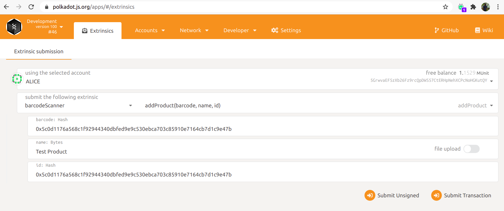

# Vaccine supply chain

 An  IoT + Blockchain Based solution to avoide any counterfeit and create transperancy in vaccine distrubution.
we have used substrate(version 2.0.0) for the project and  vue.js for front-end.
it has a one pallet- barcode scanner 
which  has a callable  function add_vaccine which will be called  when manufacuturer wants to add the details about vaccines 
Only Manufacturer/ trusted authority are permitted to  add vaccines barcode and other details on the blockchain 
if a individual wants  to verify if  a vaccine is original or counterfeited they can visit the dapp  and  scan the barcode on the vaccine 
and verify the validity for the vaccine 

Demo -https://youtu.be/fZFkptoubRw


### Vue White Dashboard

* Product Page: https://www.creative-tim.com/product/vue-white-dashboard
* Copyright 2019 Creative Tim (https://www.creative-tim.com)
* Licensed under MIT (https://github.com/creativetimofficial/vue-white-dashboard/blob/master/LICENSE.md)

* Coded by Creative Tim

* The above copyright notice and this permission notice shall be included in all copies or substantial portions of the Software.

### POLKADASH

* Author: Bruno Skvorc https://github.com/Swader/polkadash
* Product Page: https://dotleap.com/
* Licensed under MIT https://github.com/Swader/polkadash/blob/master/LICENSE.md

=====================================================

## Getting Started

### Rust Setup

Follow the [Rust setup instructions](./doc/rust-setup.md) before using the included Makefile to
build the Node Template.

### Makefile

This project uses a [Makefile](Makefile) to document helpful commands and make it easier to execute
them. Get started by running these [`make`](https://www.gnu.org/software/make/manual/make.html)
targets:

1. `make init` - Run the [init script](scripts/init.sh) to configure the Rust toolchain for
   [WebAssembly compilation](https://substrate.dev/docs/en/knowledgebase/getting-started/#webassembly-compilation).
1. `make run` - Build and launch this project in development mode.

The init script and Makefile both specify the version of the
[Rust nightly compiler](https://substrate.dev/docs/en/knowledgebase/getting-started/#rust-nightly-toolchain)
that this project depends on.

### Build

The `make run` command will perform an initial build. Use the following command to build the node
without launching it:

```sh
make build
```

### Embedded Docs

Once the project has been built, the following command can be used to explore all parameters and
subcommands:

```sh
./target/release/node-template -h
```

## Run

The `make run` command will launch a temporary node and its state will be discarded after you
terminate the process. After the project has been built, there are other ways to launch the node.

### Single-Node Development Chain

This command will start the single-node development chain with persistent state:

```bash
./target/release/node-template --dev
```

Purge the development chain's state:

```bash
./target/release/node-template purge-chain --dev
```
### Run with Instant-Seal consensus

If you want to avoid creating empty blocks and allow only when a new transaction arrives, you can run below command.

```bash
./target/release/node-template --dev --instant-sealing
```
### How to add product and verify barcode

* After executing `make run`, Use this link to open the Polkadot JS Apps UI `https://polkadot.js.org/apps/#/explorer?rpc=ws://127.0.0.1:9944`
  
* Open Extrinsics and fill following inputs to add the product in storage.
  
* 
  
* Click on `Submit Transaction` and product will be added.
  
* Open terminal and execute below curl request to verify barcode

`curl -H "Content-Type: application/json" -d '{"id":1, "jsonrpc":"2.0", "method": "barcode_scanner_is_valid_barcode", "params": ["0x5c0d1176a568c1f92944340dbfed9e9c530ebca703c85910e7164cb7d1c9e47b"]}' http://localhost:9933/`

You will get below response.

`{"jsonrpc":"2.0","result":true,"id":1}`


### Run Benchmarking
Run `make benchmark` command and execute
./target/release/node-template benchmark --chain=dev --execution=wasm --wasm-execution=compiled --pallet=pallet_barcode_scanner --extrinsic='*' --steps=50 --repeat=20 --heap-pages=4096 --template=./frame-weight-template.hbs --output=./pallets/barcode-scanner/src/weights.rs
